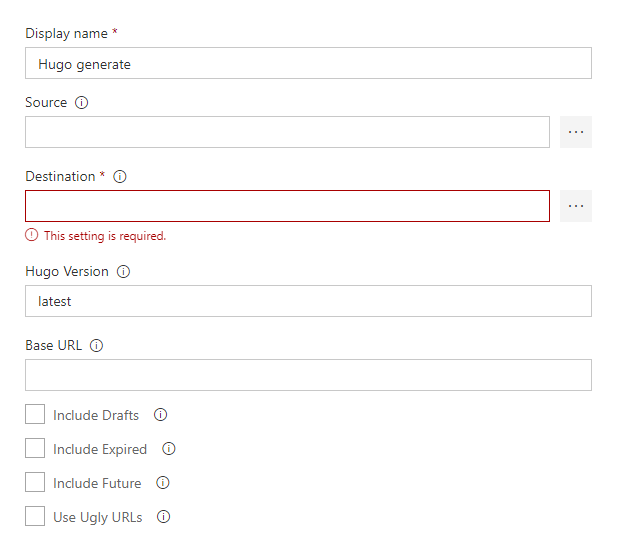

Generates a site using Hugo, a Fast and Flexible Website Generator.

# Usage

The Build Task will automatically download the `hugo` executable, if the version is not already present on the build machine, and invoke it.

You can specify some common options.

- **Source**: relative path from repo root of the Hugo sources, defaults to `Build.SourcesDirectory`, passed as `--source` flag.
- **Destination**: path of Hugo generated site, typically `Build.ArtifactStagingDirectory`, passed as `--destination` flag.
- **Hugo Version**: defines the Hugo version, use `latest`, `0.25.1`, `0.24`, but not `v0.24` (pick valid values from Hugo [Releases](https://github.com/gohugoio/hugo/releases) page). If the preferred version cannot be found, the latest released version will be used instead.
- **Extended Version**: download the extended Hugo version (SCSS/SASS support).
- **Base URL**: sets the hostname (and path) to the root, e.g. `http://example.com/`, passed as `--baseURL` flag.
- **Include Drafts**: to include content marked as draft, passed as `--buildDrafts` flag.
- **Include Expired**: to include expired content, passed as `--buildExpired` flag.
- **Include Future**: to include content with publishdate in the future, passed as `--buildFuture` flag.
- **Use Ugly URLs**: to use `/filename.html` instead of `/filename/`, passed as `--uglyURLs` flag.

A detailed walk through is here [Building a Hugo Site with the VSTS Extension](vsts-extension-step-by-step)

More Information on Hugo on [this site](https://gohugo.io/).

The Hugo logos are copyright © Steve Francia 2013–2018.

# Release Notes

## 1.1.0

- Fixes ([ISSUE#5](https://github.com/giuliov/hugo-vsts-extension/issues/5))
- Added support for Extended version (Hugo 0.43 and later)

## 1.0.1

- Use TLS 1.2 for GitHub API ([PR#3](https://github.com/giuliov/hugo-vsts-extension/pull/3))

## 1.0.0

- Initial release
