# Using the Hugo Azure DevOps Extension Step-by-Step
This guide assumes that you are already familiar with [Azure DevOps](https://dev.azure.com/) and you have successfully built your Hugo site locally. Test your site to ensure that it functions correctly locally before proceeding with the build automation. If you are going to use the Release steps in this guide you need to prepare an Azure Storage Account with a container for your files.

## Create a Azure DevOps Build

1. In your Azure DevOps project choose **Build and release**.
1. Choose **New Build Pipeline**
1. Select your source repository and default branch and choose **Continue**.
    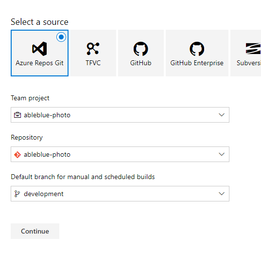
1. Select the **Empty Job** template. 
1. Rename the build pipeline if you like, then choose the *Get sources** task. Select **Checkout submodules** if your Hugo project uses a theme as a submodule.
1. Choose the **+** on the Run agent to add a task.
    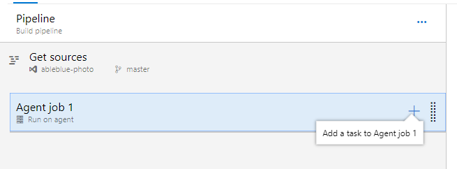
1. Search for the **Hugo** Azure DevOps extension and choose **Add**. If you have not previously installed the extension you will be taken to the Marketplace where you can add it for free.
    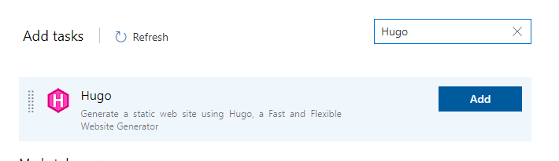
1. Choose the Hugo generate task and review the settings. 
    * The Source uses **$(Build.SourcesDirectory)** by default
    * The Destination can be set to **$(Build.ArtifactStagingDirectory)** (this will save you a copy step later).
    * Set your desired Hugo version if necessary.
    * Set your Base URL as appropriate for the target host site. This setting enables you to use the same config file for development, test, and production by changing this variable in each build environment.
    * Set the additional option settings as appropriate. For example if you are testing content you may want the **Include Drafts** and **Include Future** options. 
    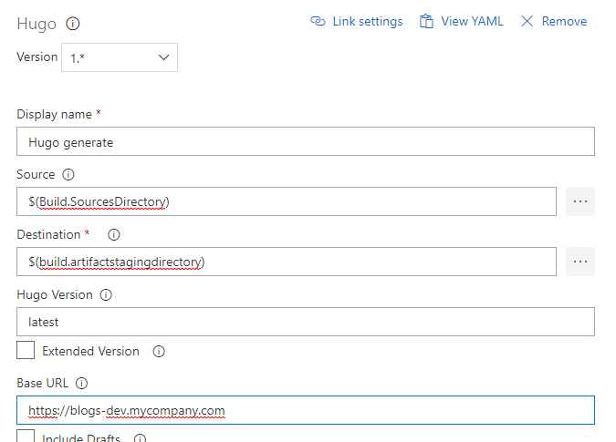
1. Add a **Publish Build Artifacts** task below the Hugo build task.
    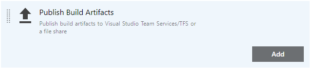
1. Configure the Publish task as follows:
    * Set the **Path to publish** to **$(Build.ArtifactStagingDirectory)**. This is the contents of the _public_ directory that you see when building your site locally.
    * Set the **Artifact name** to **public**. (This step is optional, you can set it to anything you like but I think calling it "public" makes it obvious what it is you are publishing.)
    * Leave the **Artifact publish location** set to **Visual Studio Team Services/TFS**.
    
1. Choose **Save \& Queue** to save and test your work.

## Testing the Build
Once the build completes you should see the results in the details of the job history. you should see the same number of files and pages built as you do when performing a local Hugo build.
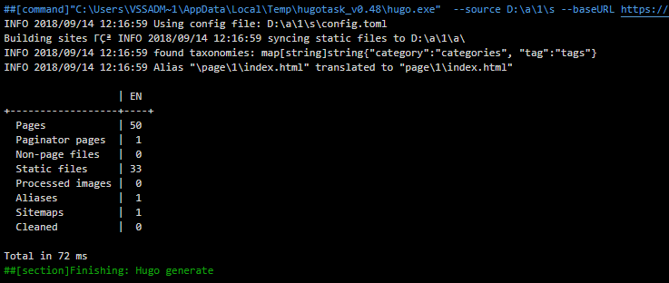

## Create a Azure DevOps Release

Once you are certain that the Build is working correctly you can create a Release that uses the **Public** artifact from the Build. The following steps use Azure CLI commands to clear the destination directory in an Azure Storage account and then copy the build files to the storage location. This method can be improved and optimized, but demonstrates one method for using the build artifact in a release.

>Huge props to Carl-Hugo Marcotte for his blog series [How to deploy and host a Jekyll website in Azure blob storage using a Azure DevOps continuous deployment pipeline](https://www.forevolve.com/en/articles/2018/07/10/how-to-deploy-and-host-a-jekyll-website-in-azure-blob-storage-using-a-vsts-continuous-deployment-pipeline-part-1/) even though it's written for Jekyll it was perfect for this Hugo application.

1. Choose **Releases** and choose **+ Add** to create a new release pipeline. Choose **Empty job**.
    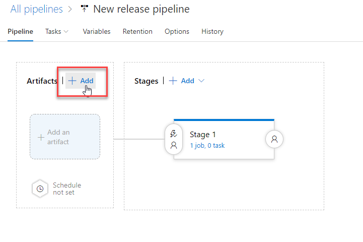
1. In the **Add an artifact** blade choose the artifact from the Build process you created and named above. You should see a confirmation at the bottom of the blade indicating that **Public** is the name of your published build artifact. Click **Add**.
    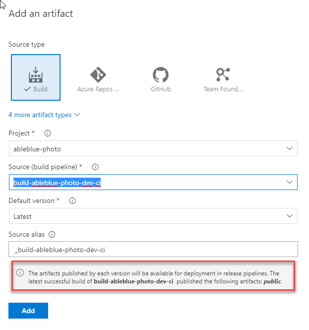
1. In stage 1, choose the link to view the Stage.
    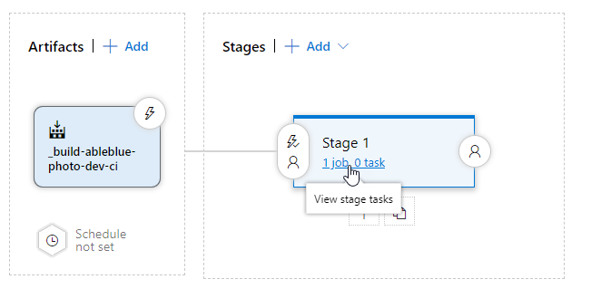
1. Click the **+** and search for **CLI**. Add two **Azure CLI** tasks to the run agent.
    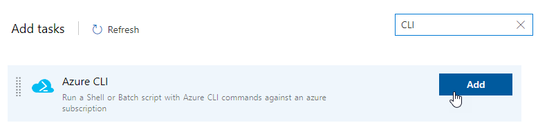
1. Choose the first **Azure CLI** task. Configure it as follows:
    * Change the **Display name** to **Delete Old Files**.
    * Change the **Script location** to **Inline script**.
    * Change the **Inline script** to
    ```` powershell
    az storage blob delete-batch --source $(containerName) --account-name $(storageAccount) --output table
    ````
    * Set the **Working directory** to **$(System.DefaultWorkingDirectory)/what-ever-your-build-is** (Use the **...** selector to be sure you get this right.)
1. Choose the second **Azure CLI** task and configure the settings as follows:
    * Change the **Display name** to **Upload new files**.
    * Change the **Script location** to **Inline script**.
    * Change the **Inline script** to
    ```` powershell
    az storage blob upload-batch --source $(artifactName) --destination $(containerName) --account-name $(storageAccount) --output table --no-progress
    ````
    * Set the **Working directory** to **$(System.DefaultWorkingDirectory)/what-ever-your-build-is** (Use the **...** selector to be sure you get this right.)
1. Click **Save**.
1. Choose the **Variables** tab and add the three pipeline variables for the _az storage_ commands.
    * **storageAccount** - Your Azure Storage Account name.  
    * **containerName** - The BLOB container in the storage account.
    * **artifactName** - The artifact from the Build pipeline. In this demo that is _public_.
    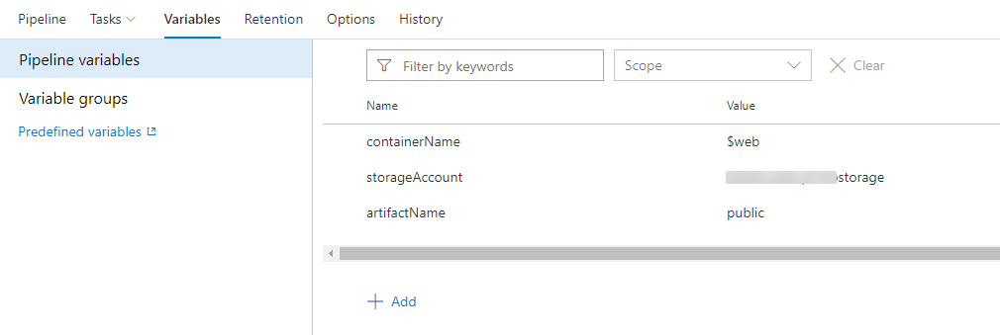
1. Choose **Save**.
1. Choose **All pipelines** to return to the main page. On the **Overview** tab choose **Releases | Create a release**.
    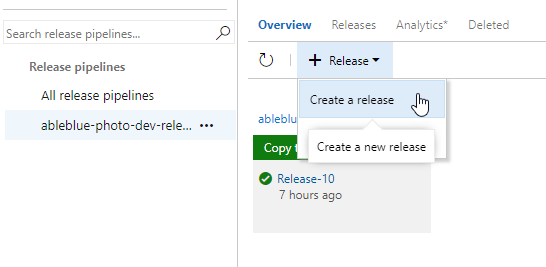
1. In the **Create a new release** dialog, choose **Create**.
1. Click the release creation message to view the release in real time.
    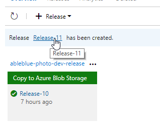
1. You should see your release proceed through the steps you created for deletion and copying the new files.
    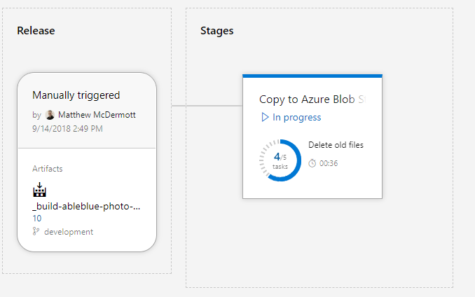
1. When the release completes you should see a success message.
    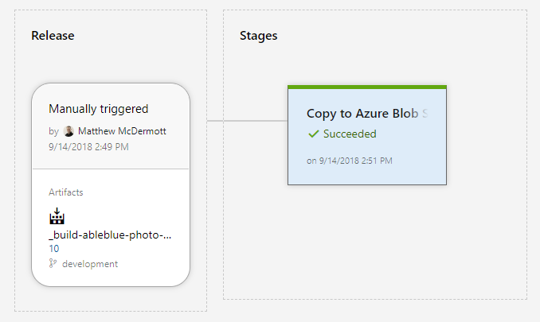
